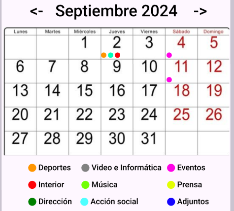
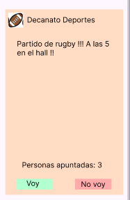
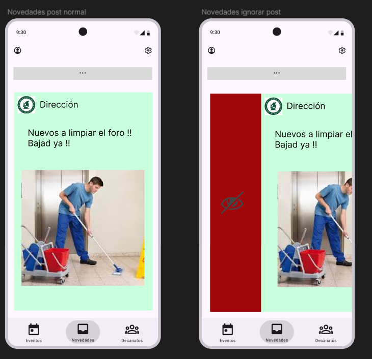

###### Miguel Pérez Ballester
# Documentación App Europa

## Indice
- [Diseño de la app](#diseño)
    - [Resumen](#resumen)
    - [Como usar la app como colegial](#como-usar-la-app-como-colegial)
    - [Como usar la app como colegial que crea posts](#como-usar-la-app-como-colegial-que-crea-posts)
    - [Posts](#posts)
    - [Pestaña novedades](#pestaña-novedades)
    - [Pestaña eventos](#pestaña-eventos)
    - [Pestaña decanatos](#pestaña-decanatos)
- [Desarrollo de la app](#desarrollo)
    - [Por hacer](#por-añadir)

### DISEÑO

#### Resumen

Esta aplicación es una app distribuida tanto como para android y para ios que servirá de forma de gestión de los decanatos y eventos del Europa. La usarán durante el curso los aproximadamente 200 colegiales.

La aplicación se basa en recibir [posts](#posts), que los usuarios con privilegios podrán crear y distribuir a todos los colegiales o a un grupo determinado de colegiales. 

En estos post se podrá poner un simple difundido con opcionalmente alguna imagen, un difundido con un cuestionario de sí o no en el que poder votar.

#### Como usar la app como colegial

Como colegial, al abrir la aplicación se presentará una pantaña de inicio de sesión. La contraseña y usuario serán proporcionadas por el decano de informática y con ellas podrás entrar. 
Una vez dentro, puedes ver los posts que se van publicando en la pestaña de NOVEDADES. En esta pestaña para pasar al siguiente post se tiene que deslizar hacia la derecha, revelando el siguiente en la cola. Si no hay más, saldrá un mensaje diciendo que la cola está vacía.
En la pestaña de EVENTOS, se verá un calendario que contiene el calendario del curso y se puede ciclar entre meses. En cada día podrá haber unas bolitas de colores indicando que hay eventos de un determinado decanato en ese día. En la leyenda se puede saber cuál es.

Al clicar en un día, saldrá una ventana deslizable verticalmente que se podrá ver todos los eventos disponibles para ese día. En caso de ser privilegiado, se podrá ver más información sobre ese post, como quién lo ha visto, quien ha votado, y quien ha confirmado lectura mediante deslizar.

Finalmente en la pestaña de DECANATOS, se puede hacer algo similar al calendario y entrar en un decanato concreto para poder ver todos los eventos que han habido de ese decanato. Es de notar que si el usuario no pertenece al grupo objetivo del post, no lo podrá ver en esta pestaña. Por ejemplo, si el usuario no pertenece al club de tenis y entra en la sección de decanato de deportes, no verá los post dirijidos al club de tenis.

También habrá una sección para ver los menús del día, así como los vigías (DUDA ?)
Se intentará hacer para que los menús del día se suban automáticamente ese mismo día por la mañana como post.

#### Como usar la app como colegial que crea posts

Como colegial que crea posts, se te asignará un privilegio sobre ciertos decanatos. Por ejemplo, el entrenador de rugby será capaz de ver estadísticas y crear posts para el decanato de deportes. 
En la pestaña de DECANATOS habrá un botón que mostrará los decanatos donde se podrá publicar. Al elegir el decanato, luego se elegirá el grupo de gente al que mandar el post, y finalmente ya el post en sí con su difundido e imagen opcional.
Si se quiere, se podrá tickar una opción para incluir la encuesta. Esto activará los dos botones y registrará a quien dice que sí, que no y el que ignora los botones.

En caso de querer ver información sobre los posts ya publicados, se accede a la pestaña DECANATOS, donde le da al botón del decanato deseado, y desde ahí en cada post saldrá un botón de 3 líneas, que al pulsar mostrará una caja donde dirá las estadísticas del post.

#### Posts

Los post contienen un encabezado y un color de fondo que dictan a que decanato pertenece el post.  
 
Luego tendrá un texto que podrá contener emojis y opcionalmente una imagen.
Luego existe la opción de tener una encuesta de si o no donde el usuario podrá votar en función al texto. Esto quedará registrado en el contador de personas apuntadas, y si se clica el botón de personas apuntadas, saldrá una lista con los usuarios que han pulsado el botón de VOY.
También se podrá deslizar el post hacia la derecha para confirmar lectura, que quitará el post y revelará los siguientes post en la cola. Esto también queda registrado y el creador del post podrá verlo.

El creador del post puede dirigir el post a un grupo determinado de personas, como el equipo de rugby masculino por ejemplo, o a todos los colegiales si lo necesita. El creador puede ver cuánta gente ha visto el post, cuanta gente lo ha ignorado, y cuanta gente le ha dado a VOY y a NO VOY.

NO ES LO MISMO POST QUE EVENTO DEL CALENDARIO.
Para añadir un evento al calendario se hará de forma similar pero solo será un texto que saldrá el día del evento.

#### Pestaña eventos

Desde esta pestaña se podrá ver los eventos distribuidos en un calendario, separados por decanatos y visibles por bolitas de colores debajo de cada día que indican que ese día habia evento.
El significado de los colores de las bolitas lo muestra una leyenda justo abajo del calendario. 
Al clicar en un día, muestra los eventos de ese día en forma de deslizador vertical.

#### Pestaña novedades

Aquí saldrán los post nuevos. Para confirmar lectura y pasar al siguiente se tiene que deslizar a la derecha. Desde aquí también se podrá acceder a tu cuenta y a ajustes (no se si haré algo para esas dos secciones)

#### Pestaña decanatos

En esta pestaña se podrán ver todos los posts de todos los distintos decanatos. Al clicar en un decanato saldrán todos en forma de deslizador vertical y podrás verlos.
Desde aquí los usuarios con privilegios podrán subir posts.
Se podrán ver todos los posts de los decanatos, así como los posts de enlaces al vigía o los posts sobre el comedor.

## DESARROLLO 
### Por añadir

- [ ] Sistema de inicio de sesión
- [ ] Componente post
- [ ] Diseño de pestaña de decanatos
- [ ] Diseño de pestaña de novedades
- [ ] Diseño de pestaña de eventos
- [ ] Funcionalidad de pestaña de decanatos
- [ ] Funcionalidad de pestaña de decanatos
- [ ] Funcionalidad de pestaña de decanatos

##### OPCIONAL O NO SEGURO DE AÑADIR
- [ ] Pestaña de editar datos de usuario
- [ ] Customizar color de posts
- [ ] Añadir emojis reacción
- [ ] Pestaña de lector de vigías

### Datos

#### FRONTEND

react native (expo)

#### BACKEND

### Notas

npm run android 

para declarar variables en react supongo, antes del return
const [newItem, setNewItem] = useState("")
const [todos, setTodos] = useState([])
para cambiarlas es necesario usar el setTodos

si queremos acceder a una variable o hacer cosas de js en la parte de html tenemos que meterlo en curly brackets {} 

{condition && "value"} si condition, mostramos value

coger datos de local
const [todos, setTodos] = useState(() => {
    const localValue = localStorage.getItem("ITEMS")
    if (localValue == null) return []

    return JSON.parse(localValue)
  })

  useEffect(() =>{
    localStorage.setItem("ITEMS", JSON.stringify(todos))
  }, [todos])

Especificaciones del Servidor
Requisitos Mínimos

    CPU:
        2 vCPUs.
    Memoria (RAM):
        4 GB.
    Almacenamiento:
        40 GB SSD.
    Ancho de Banda:
        100 Mbps.
    Sistema Operativo:
        Linux (Ubuntu, CentOS, etc.).

Requisitos Recomendados

    CPU:
        4 vCPUs.
    Memoria (RAM):
        8 GB.
    Almacenamiento:
        80 GB SSD.
    Ancho de Banda:
        200 Mbps o más.
    Sistema Operativo:
        Linux (Ubuntu, CentOS, etc.).

Tecnologías Recomendadas

    Backend:
        Node.js con Express.
        Django o Flask si prefieres Python.
        Spring Boot para Java.

    Base de Datos:
        PostgreSQL o MySQL para bases de datos relacionales.
        MongoDB si prefieres una base de datos NoSQL.

    Servidor Web:
        Nginx para manejar las solicitudes HTTP y servir contenido estático.

    Autenticación:
        JWT (JSON Web Tokens) para manejar la autenticación y autorización.

    APIs REST:
        Crear endpoints REST para manejar la creación, lectura, actualización y eliminación (CRUD) de los posts.

        Implementación Paso a Paso
Configuración del Servidor

    Instalación y Configuración del Servidor:
        Configura una instancia de Linux en tu proveedor de cloud (AWS, DigitalOcean, etc.).
        Instala Node.js y Nginx.
        Configura un firewall para permitir solo el tráfico necesario (HTTP/HTTPS).

    Configuración de la Base de Datos:
        Instala y configura PostgreSQL, MySQL o MongoDB.
        Crea una base de datos y tablas/colecciones necesarias para almacenar los posts y usuarios.

Desarrollo del Backend

    Crear un Servidor Express:

    javascript

const express = require('express');
const bodyParser = require('body-parser');
const cors = require('cors');
const app = express();

app.use(bodyParser.json());
app.use(cors());

// Endpoints
app.post('/posts', (req, res) => {
    // Lógica para crear un post
});

app.get('/posts', (req, res) => {
    // Lógica para obtener todos los posts
});

app.get('/posts/:id', (req, res) => {
    // Lógica para obtener un post por ID
});

app.listen(3000, () => {
    console.log('Server is running on port 3000');
});

Conectar a la Base de Datos:

    Usa un ORM como Sequelize (para PostgreSQL/MySQL) o Mongoose (para MongoDB).

javascript

    const { Sequelize } = require('sequelize');
    const sequelize = new Sequelize('database', 'username', 'password', {
        host: 'localhost',
        dialect: 'postgres' // o 'mysql'
    });

    // Definir un modelo para los posts
    const Post = sequelize.define('Post', {
        title: {
            type: Sequelize.STRING,
            allowNull: false
        },
        content: {
            type: Sequelize.TEXT,
            allowNull: false
        }
    });

    sequelize.sync();

Desarrollo de la Aplicación Móvil

    Configurar React Native:
        Crea un nuevo proyecto con Expo o React Native CLI.

    sh

npx expo init MySocialApp
cd MySocialApp

Hacer Solicitudes HTTP al Servidor:

    Usa Axios para interactuar con la API REST del backend.

javascript

    import axios from 'axios';
    import React, { useState, useEffect } from 'react';
    import { View, Text, Button, TextInput, FlatList } from 'react-native';

    const App = () => {
        const [posts, setPosts] = useState([]);
        const [newPost, setNewPost] = useState({ title: '', content: '' });

        useEffect(() => {
            axios.get('http://YOUR_SERVER_IP:3000/posts')
                .then(response => {
                    setPosts(response.data);
                });
        }, []);

        const addPost = () => {
            axios.post('http://YOUR_SERVER_IP:3000/posts', newPost)
                .then(response => {
                    setPosts([...posts, response.data]);
                    setNewPost({ title: '', content: '' });
                });
        };

        return (
            <View>
                <TextInput
                    placeholder="Title"
                    value={newPost.title}
                    onChangeText={(text) => setNewPost({ ...newPost, title: text })}
                />
                <TextInput
                    placeholder="Content"
                    value={newPost.content}
                    onChangeText={(text) => setNewPost({ ...newPost, content: text })}
                />
                <Button title="Add Post" onPress={addPost} />
                <FlatList
                    data={posts}
                    renderItem={({ item }) => (
                        <View>
                            <Text>{item.title}</Text>
                            <Text>{item.content}</Text>
                        </View>
                    )}
                    keyExtractor={(item) => item.id.toString()}
                />
            </View>
        );
    };

    export default App;

Seguridad y Mantenimiento

    Implementar SSL/TLS:
        Usa Let's Encrypt para obtener un certificado SSL gratuito.
        Configura Nginx para manejar HTTPS.

    Autenticación y Autorización:
        Implementa JWT para manejar la autenticación de usuarios.

    Backups y Monitoreo:
        Configura backups automáticos de la base de datos.
        Usa herramientas como PM2 para monitorear y mantener el servidor Node.js.

Docker: Si tu portátil lo permite, puedes usar Docker para contenerizar tu aplicación. Esto facilita la gestión del entorno y el despliegue.
PM2: Es una herramienta de manejo de procesos para Node.js que puede reiniciar tu aplicación automáticamente en caso de fallos y mantenerla corriendo como un servicio.